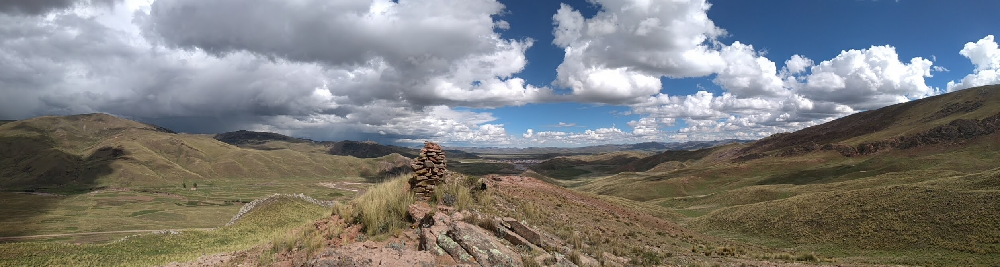

## Making it happen!

In 1990, when everybody wanted to migrate to big/capital cities, we decided to return to our roots, our culture, traditions, ancestral knowledge, to our identity.

In 1996, we decided to move to our current house in the mountains, it is at 4100 m.a.s.l. and there were, literally, nothing, any stones, no water supply, nor animals. So, we had to do everything from scratch.

In 2000, we started to move forward and decided to combine the school with soustanible farming. For instance, that year we decided to plan trees all over the mountain, around the house, next to some hiden places where trees might be covered from the intense sun radiation. The coming years we planted at around 200 trees (not bad, right?).

In 2005, several things happen.

